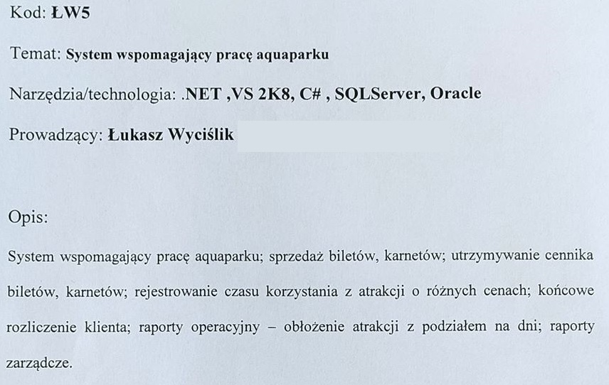
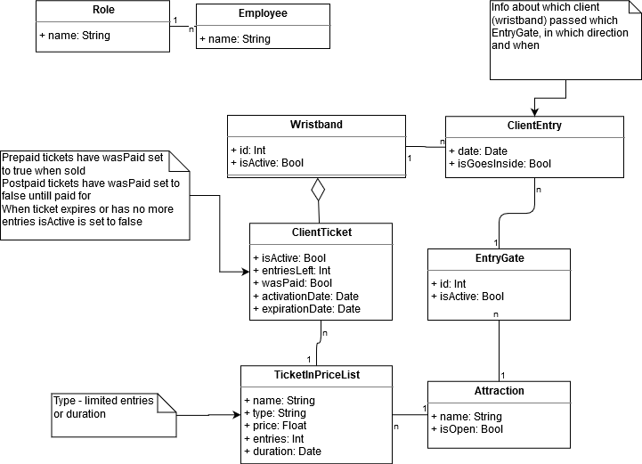
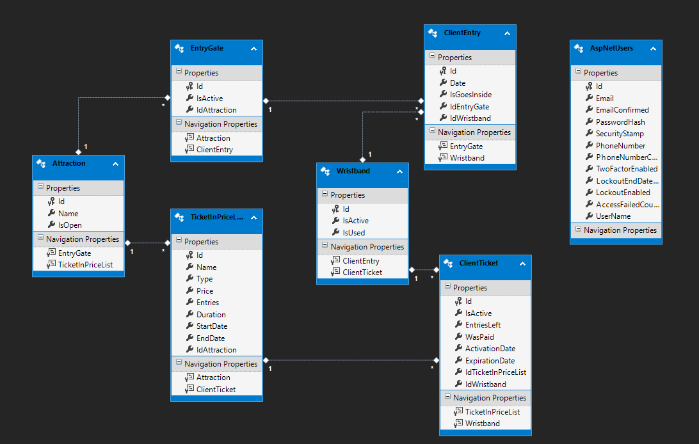
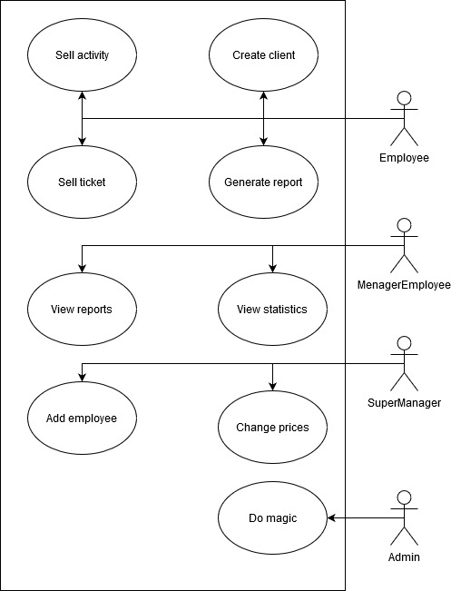
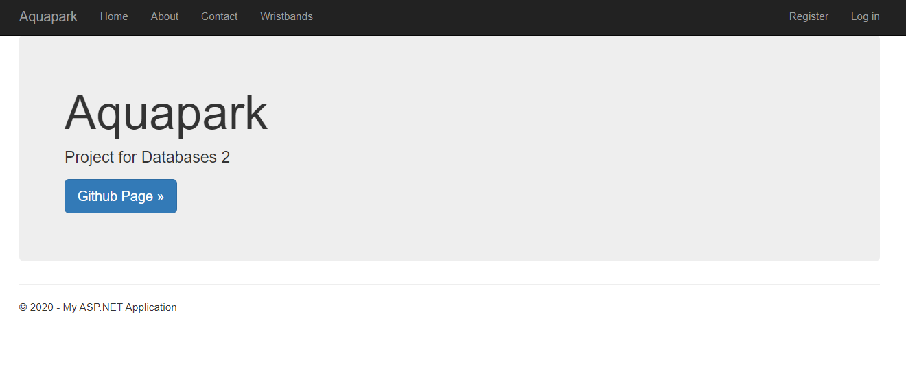
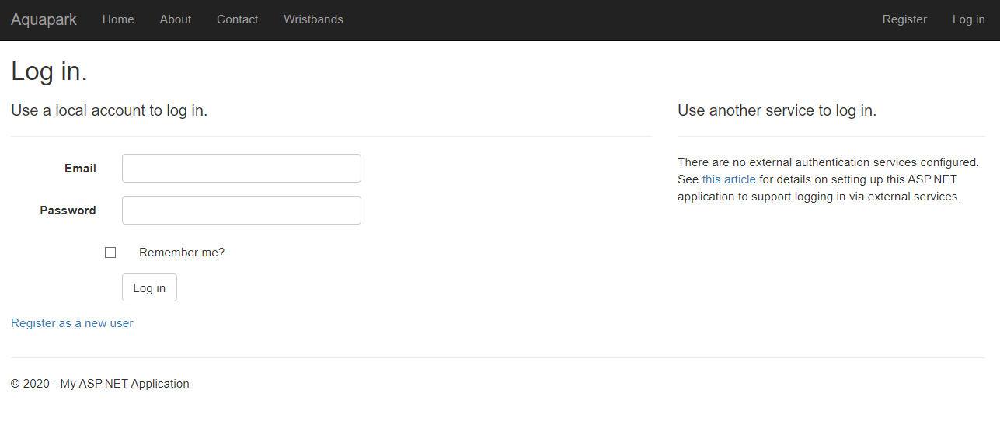
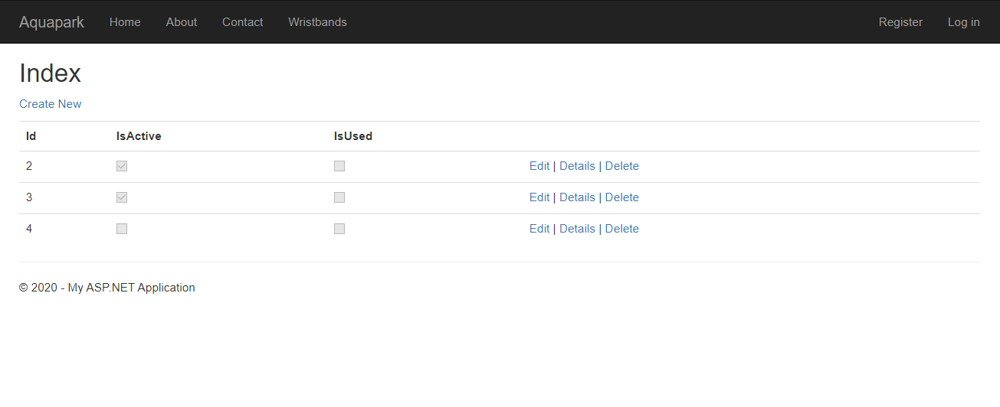

# AEII_2020_BD2_ZAWIERUCHA_AQUAPARK
Projekt na bazy danych 2 - System wspomagający pracę aquaparku

## Polecenie:

## Diagram klas:

## Model bazy danych:

## Diagram przypadków użycia:

## Przykładowe ekrany aplikacji:

