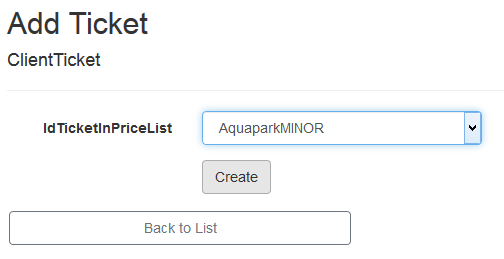
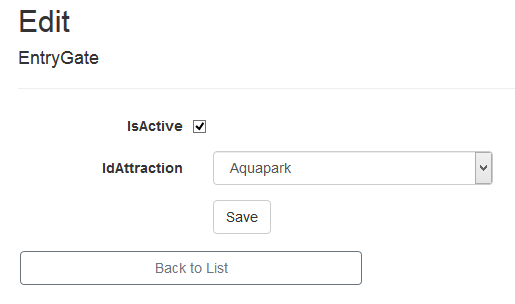

# AEII_2020_BD2_ZAWIERUCHA_AQUAPARK
Projekt na bazy danych 2 - System wspomagający pracę aquaparku

# Spis Treści
#### [Opis Projektu](https://github.com/PawZawDev/AEII_2020_BD2_ZAWIERUCHA_AQUAPARK/blob/master/README.md#polecenie)
#### [Instrukcja Użytkowania](https://github.com/PawZawDev/AEII_2020_BD2_ZAWIERUCHA_AQUAPARK/blob/master/README.md#instrukcja-u%C5%BCytkowania)
- [Employee](https://github.com/PawZawDev/AEII_2020_BD2_ZAWIERUCHA_AQUAPARK/blob/master/README.md#employee)
  -
- [Manager](https://github.com/PawZawDev/AEII_2020_BD2_ZAWIERUCHA_AQUAPARK/blob/master/README.md#manager)
- [SuperManager](https://github.com/PawZawDev/AEII_2020_BD2_ZAWIERUCHA_AQUAPARK/blob/master/README.md#supermanager)
- [Admin](https://github.com/PawZawDev/AEII_2020_BD2_ZAWIERUCHA_AQUAPARK/blob/master/README.md#admin)

## Polecenie:

## Diagram klas:

## Model bazy danych:

## Diagram przypadków użycia:

## Przykładowe ekrany aplikacji:

## Instrukcja Użytkowania

Aby korzystać z funkcji strony należy się zalogować do odpowiedniego konta.
Istnieją 4 rodzaje kont, każdy z własnym zestawem uprawnień:

## Employee:
Login: employee@gmail.com
Hasło: ASDqwe`12

Uprawnienia:
- Przeglądanie aktualnego cennika
- Wyświetlać informacje o danym bilecie w cenniku
- Wyświetlanie informacji o opaskach i biletach na nich
- Sprzedawanie nowego biletu
- Realizacja płatności za bilety
- Zwrócenie opaski

#### Realizacja płatności za bilety
Aby zrealizować płatność za bilet należy:
- w zakładce "Wristbands" wybrać opcję "Get Tickets" przy właściwej opasce

- wybrać "Pay Tickets", a następnie "Finish Payment"

#### Rejestrowanie zwrotu opaski
Aby zarejestrować zwrócenie opaski należy:
- w zakładce "Wristbands" wybrać opcję "Return Wristband" przy właściwej opasce

Jeżeli na opasce znajdują się nieopłacone bilety zostaniemy przekierowani do strony płatności.

#### Sprzedanie biletu
Aby sprzedać nowy bilet należy:
- w zakładce "Wristbands" wybrać opcję "Create Ticket" przy właściwej opasce

- wybrać rodzaj biletu, a następnie opcję "Create"

## Manager:
Login: manager@gmail.com
Hasło: ASDqwe`12

Uprawnienia:
- Wszystkie uprawniania Employee
- Wyświetlanie informacji o wszystkich aktywnych biletach klientów
- Wyświetlanie informacji o bramkach
- Wyświetlanie informacji o przejściach klientów przez bramki
- Wyświetlanie raportów

#### Oglądanie raportu
Aby zobaczyć raport należy:
- w zakładce "Reports" wybrać odpowiedni wykres

- dodatkowo wybrać opcję "Create Report PDF", aby wygenerować plik PDF

## SuperManager:
Login: supermanager@gmail.com
Hasło: ASDqwe`12

Uprawnienia:
- Wszystkie uprawniania Manager
- Edycja/deaktywacja opasek
- Dodawanie nowych opasek
- Edycja/zamykanie atrakcji
- Dodawanie nowych atrakcji
- Zmiana biletów w cenniku
- Symulacja przejścia klienta przez bramkę
- Edycja/deaktywacja bramek
- Dodawanie  nowych bramek

#### Edycja opaski
Aby edytować opaskę należy:
- w zakładce "wristbands" wybrać opcję "Edit" przy odpowiedniej opasce

- dokonać zmian i wybrać opcję "Save"

#### Tworzenie opaski
Aby utworzyć opaskę należy:
- w zakładce "Wristbands" wybrać opcję "Create New"
- wypełnić wymagane pola i wybrać opcję "Create"

#### Edycja atrakcji
Aby edytować atrakcję należy:
- w zakładce "Attractions" wybrać opcję "Edit" przy odpowiedniej atrakcji

- dokonać zmian i wybrać opcję "Save"

#### Edycja cennika
Aby edytować cennik należy:
- w zakładce "PriceList" wybrać opcję "Update" przy odpowiedniej pozycji

- dokonać zmian i wybrać opcję "Save"

#### Nowa pozycja w cenniku
Aby utworzyć nową pozycję w cenniku należy:
- w zakładce "PriceList" wybrać opcję "Create New"
- wypełnić wymagane pola i wybrać opcję "Create"

#### Symulacja przejścia klienta przez bramkę
Aby zasymulować przejście klienta przez bramkę należy:
- w zakładce "ClientEntries" wybrać opcję "Simulation"

- wypełnić wymagane pola i wybrać opcję "Create"

#### Edycja bramki
Aby edytować bramkę należy:
- w zakładce "EntryGates" wybrać opcję "Edit" przy aktywnej bramce

- dokonać zmian i wybrać opcję "Save"

#### Dodanie bramki
Aby dodać nową bramkę należy:
- w zakładce "EntryGates" wybrać opcję "Create New"
- wypełnić wymagane pola i wybrać opcję "Create"

## Admin:
Login: admin@gmail.com
Hasło: ASDqwe`12

Uprawnienia:
- Pełen CRUD
- Wszystkie uprawnienia SuperManager
- Zarządzanie użytkownikami strony
- "Ręczne" dodawanie/edycja pozycji do bazy danych

#### Usuwanie lub edytowanie danych
Aby trwale usunąć lub edytować dowolną pozycję należy:
- zgodnie z powyższymi instrukcjami udać się do danej zakładni i wybrać odpowiednią opcję.

#### Zarządzanie użytkownikami
Aby zarządzać użytkownikami na stronie należy:
- w zakładce "AspNetUsers" przewinąć stronę na prawo i wybrać odpowiednią z dostępnych opcji

